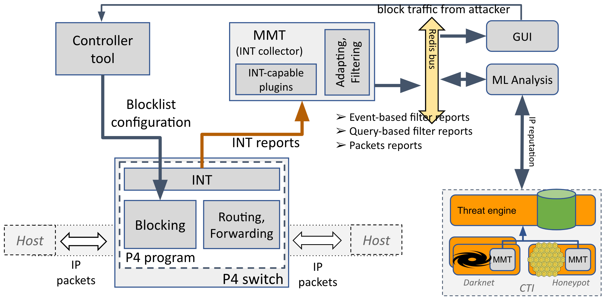

###########################################################
# A Closed-loop using INT - ML - CTI

This repository contains code of a demonstration of a closed-loop which uses:
- In-band Network Telemetry to collect network data
- ML-based detection aided by Cyber Threat Intelligence to improve its certain classification result
- P4-based firewall to block malicious traffic

The architecture of this demonstration is as the following figure.



###########################################################
# Requirement
- Ubuntu 20.04 amd 64bit
- At least 2 CPUs, 2 GB of RAM and 5 GB of hard driver
- MMT will be installed inside the "/opt/mmt" folder.
- No process is listening on port 8080 which will be attributed to MMT-Operator web server

###########################################################
# Installation

## Redis

```bash
sudo apt update
sudo apt install redis-server
# check status
sudo service redis-server status
# start it if not executing
sudo service redis-server start
```

## MMT-Operator
### NodeJS

```bash
sudo apt-get update
sudo apt-get install -y ca-certificates curl gnupg
sudo mkdir -p /etc/apt/keyrings
curl -fsSL https://deb.nodesource.com/gpgkey/nodesource-repo.gpg.key | sudo gpg --dearmor -o /etc/apt/keyrings/nodesource.gpg
NODE_MAJOR=16
echo "deb [signed-by=/etc/apt/keyrings/nodesource.gpg] https://deb.nodesource.com/node_$NODE_MAJOR.x nodistro main" | sudo tee /etc/apt/sources.list.d/nodesource.list
sudo apt-get update
sudo apt-get install nodejs -y
```

### MongoDB 4.4

```bash
sudo apt-get install -y gnupg curl
curl -fsSL https://pgp.mongodb.com/server-4.4.asc | sudo gpg -o /usr/share/keyrings/mongodb-server-4.4.gpg --dearmor
echo "deb [ arch=amd64,arm64 signed-by=/usr/share/keyrings/mongodb-server-4.4.gpg ] https://repo.mongodb.org/apt/ubuntu focal/mongodb-org/4.4 multiverse" | sudo tee /etc/apt/sources.list.d/mongodb-org-4.4.list
sudo apt-get update
sudo apt-get install -y mongodb-org
sudo service mongod start
```

```bash
sudo dpkg -i src/mmt/mmt-operator*
```

## MMT-Probe

```bash
sudo dpkg -i src/mmt/mmt-probe*
```

## ML-detector

```bash
cd src/ML-detector
sudo apt install python3-pandas
python3 -m pip install -r requirements.txt
```

## P4 supported tools
```bash
. /etc/os-release
echo "deb http://download.opensuse.org/repositories/home:/p4lang/xUbuntu_${VERSION_ID}/ /" | sudo tee /etc/apt/sources.list.d/home:p4lang.list
curl -fsSL "https://download.opensuse.org/repositories/home:p4lang/xUbuntu_${VERSION_ID}/Release.key" | gpg --dearmor | sudo tee /etc/apt/trusted.gpg.d/home_p4lang.gpg > /dev/null
sudo apt update
sudo apt install -y p4lang-bmv2 p4lang-p4c
```

Further details [here](https://github.com/p4lang/behavioral-model?tab=readme-ov-file#installing-bmv2)
 and [here](https://github.com/p4lang/p4c?tab=readme-ov-file#ubuntu)

## Docker

```bash
sudo apt-get update
sudo apt-get install ca-certificates curl
sudo install -m 0755 -d /etc/apt/keyrings
sudo curl -fsSL https://download.docker.com/linux/ubuntu/gpg -o /etc/apt/keyrings/docker.asc
sudo chmod a+r /etc/apt/keyrings/docker.asc

echo \
  "deb [arch=$(dpkg --print-architecture) signed-by=/etc/apt/keyrings/docker.asc] https://download.docker.com/linux/ubuntu \
  $(. /etc/os-release && echo "$VERSION_CODENAME") stable" | \
  sudo tee /etc/apt/sources.list.d/docker.list > /dev/null
sudo apt-get update
sudo apt-get install docker-ce docker-ce-cli containerd.io docker-buildx-plugin docker-compose-plugin
```

Further details [here](https://docs.docker.com/engine/install/ubuntu/)

###########################################################
# Configuration

## Enable/disable auto reaction

The reaction is excuted automatically when having an alert. To avoid several executing consecutivelly in case of many (false) alerts, an execution is refused if another has been executed less than 60 seconds.

To enable or disable the auto execution, you can modify `auto_perform_reaction` parameter in `/opt/mmt/operator/config.json`. When auto execution is disable, a button appears in GUI when having a alert and user needs to click on the button to perform the reaction.

## ML-detector

ML detector module is currently filter out any traffic which are not from the given IPs in `src-ips.txt`. This intention is to verify only on direction traffic, either from client to server, or vice versa.

You need to add source IPs of traffic to be verify in `src-ips.txt`.

## Redis communication

This version uses Redis bus as a moyen of communication. It is easier than using socket when having multi listeners. 

- INT-collector captures INT packets, then publish reports to Redis topic naming `report`
- MMT-Operator (GUI) subscribes to this topic to get reports to show graphes
- ML-detector subscribes to this topic to get reports to perform detection. If it detects something, it publishes an alert on the same topic `report`. The alerts' format differs from reports' format. ML-detector filters out any other messages (alerts/reports used by MMT-Operator).

By default, Redis is at `127.0.0.1`, port `6379`. If this port is in conflict, then you can use another port by changing `port` parameter at `/etc/redis/redis.conf`.

If so, you need to update the publisher and the subscribers:

- INT-collector: the parameters in `redis-output` block
- MMT-Operator: the parameters in `redis_input` block
- ML-detector: the 2 running parameters


###########################################################
# Execution

## Start Redis server if it does not:

```bash
sudo service redis-server start
```

## Start ML-detector

```bash
cd src/ML-detector
python3 ./main.py 127.0.0.1 6379
```

## Start MongoDB

```bash
sudo service mongod start
```

## Start MMT-Operator

```bash
sudo mmt-operator
```

The open your web browser at http://localhost:8080 and use `admin/mmt2nm` as username/password to login to GUI.

## Start CTI
```bash
docker run --name mi-cti -p 3000:4000 -d montimage/cti-api:ctiswagger ./root/start-swagger.sh
```

## Start P4 switch
```bash

```

## Start INT-collector

```bash
# sudo mmt-probe -i <monitor-nic>
sudo mmt-probe -i l4s-int-dummy
```

